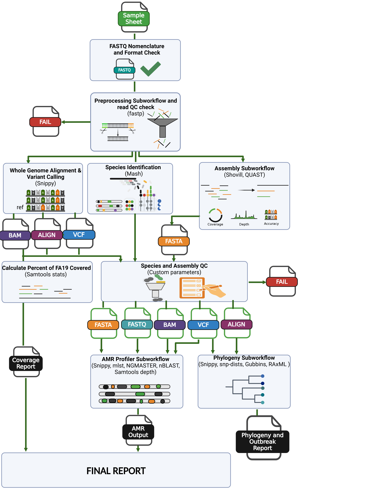
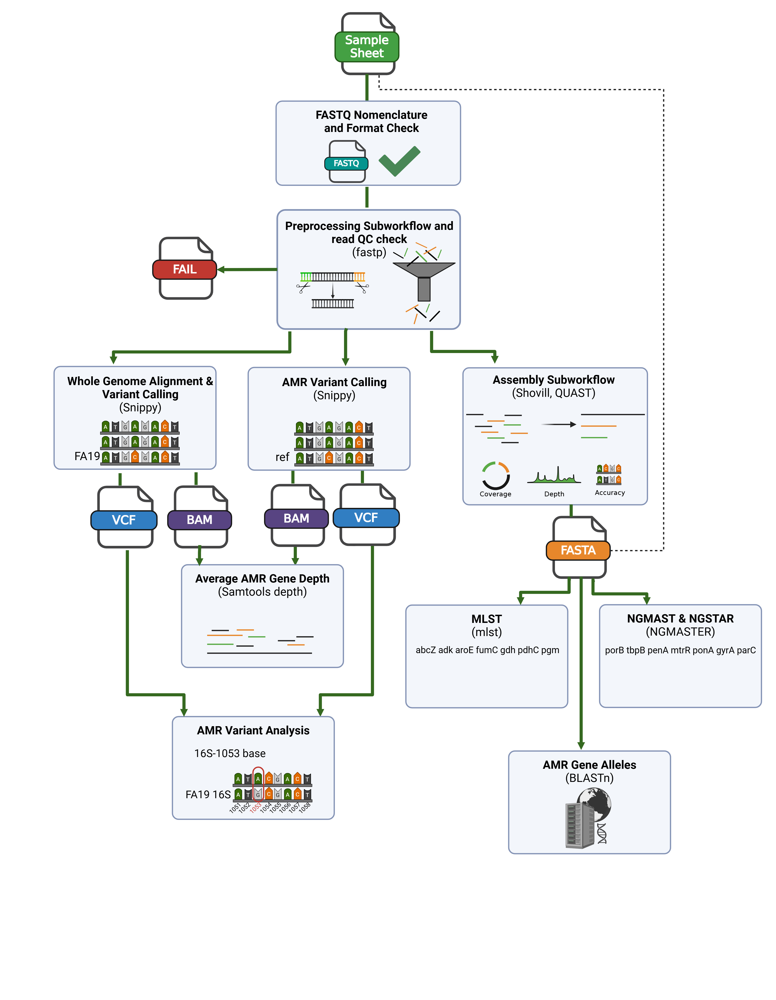
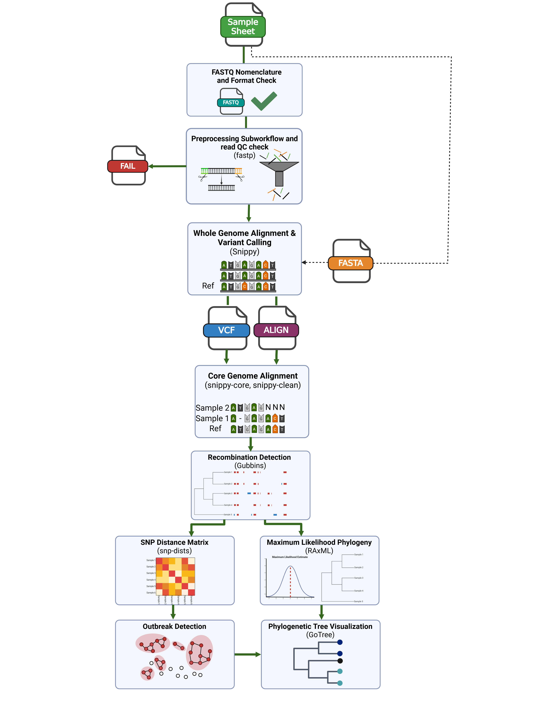

# CDCgov/neissflow

[](https://www.nextflow.io/)
[](https://github.com/nf-core/tools/releases/tag/3.3.2)
[](https://www.docker.com/)
[](https://sylabs.io/docs/)
[](https://cloud.seqera.io/launch?pipeline=https://github.com/CDCgov/neissflow)

## Introduction

**neissflow** is a bioinformatics pipeline for Neisseria gonorrhoeae (Ng) isolate genome analysis. The mission of neissflow is to consolidate commonly used bioinformatics tools for Ng analysis into a parallel and scalable pipeline. Having all your tools in one place allows you to rapidly generate data and respond quickly to public health demands! 

<center></center>

## Software
Below is a list of the bioinformatics tools currently integrated into neissflow.

 1. [fastp](https://github.com/OpenGene/fastp) - a tool for all-in-one FASTQ processing, including quality filtering, adaptor-trimming, and quality-trimming, as well as quality profiling
 2. [Samtools stats](https://www.htslib.org/doc/samtools-stats.html) - a tool for collecting statistics from BAM files and outputting them in a text format 
 3. [Mash](https://mash.readthedocs.io/en/latest/) - a tool for species screening via fast genome and metagenome distance estimation using MinHash 
 4. [Shovill](https://github.com/tseemann/shovill) - an assembly tool for illumina paired end reads 
 5. [QUAST](https://github.com/ablab/quast) - a tool for evaluating assemblies through calculating and reporting quality metrics
 6. [Snippy](https://github.com/tseemann/snippy) - a tool for rapid haploid variant calling and core genome alignment
 7. [mlst](https://github.com/tseemann/mlst) - a tool for scanning contigs against PubMLST typing schemes.
 8. [NGMASTER](https://github.com/MDU-PHL/ngmaster) - a tool for performing multi-antigen sequence typing for Neisseria gonorrhoeae (NG-MAST) and Neisseria gonorrhoeae sequence typing for antimicrobial resistance (NG-STAR)
 9. [BLASTn](https://github.com/ncbi/blast_plus_docs) - basic local alignment search tool (BLAST) for comparing nucleotide sequences to those in a database.
 10. [Samtools depth](https://www.htslib.org/doc/samtools-depth.html) - a tool for calculating the read depth at a given position from an alignment.
 11. [snp-dists](https://github.com/tseemann/snp-dists) - a tool for generating a SNP distance matrix from a FASTA core alignment
 12. [Gubbins](https://github.com/nickjcroucher/gubbins) - a tool for marking recombination regions and constructing a phylogeny based on mutations outside of those regions
 13. [RAxML-NG](https://github.com/amkozlov/raxml-ng) - a tool for performing Maximum Likelihood based inference of large phylogenetic trees
 14. [Gotree](https://github.com/evolbioinfo/gotree) - tool to manipulate phylogenetic trees and generate visualizations
 15. [MultiQC](https://pubmed.ncbi.nlm.nih.gov/27312411/) - tool for summarizing analysis results for multiple tools and samples in a single report  

## Installation

Please refer to the installation instructions in [docs/installation.md](docs/installation.md) before running neissflow

## Usage

> [!NOTE]
> If you are new to Nextflow and nf-core, please refer to [this page](https://nf-co.re/docs/usage/installation) on how to set-up Nextflow. Make sure to [test your setup](https://nf-co.re/docs/usage/introduction#how-to-run-a-pipeline) with `-profile test` before running the workflow on actual data.  
  
To run neissflow with the test profile:
```bash
nextflow run CDCgov/neissflow \
   -profile test,singularity \
   --outdir <OUTDIR> \
   --mash_db RefSeqSketchesDefaults.msh
```
The expected results from running with the test profile can be found [here](assets/expected_results/).  

neissflow also contains test profiles to test the pipeline with input both FASTQ files & FASTA files (test_both), just FASTA files (test_fasta), and to test the full pipeline, including phylogeny (test_full).

To use neissflow first prepare a samplesheet with your input data that looks as follows:

`samplesheet.csv`:

```csv
sample,fastq_1,fastq_2
CONTROL_REP1,AEG588A1_S1_L002_R1_001.fastq.gz,AEG588A1_S1_L002_R2_001.fastq.gz
```

Each row represents a fastq file (single-end) or a pair of fastq files (paired end). FASTA input is also accepted, check [usage.md](docs/usage.md) for more information.

Now, you can run the pipeline using:

```bash
nextflow run CDCgov/neissflow \
   -profile <docker/singularity/.../institute> \
   --input samplesheet.csv \
   --outdir <OUTDIR> \
   --mash_db RefSeqSketchesDefaults.msh \
   --only_fastq
```

> [!WARNING]
> Please provide pipeline parameters via the CLI or Nextflow `-params-file` option. Custom config files including those provided by the `-c` Nextflow option can be used to provide any configuration _**except for parameters**_; see [docs](https://nf-co.re/docs/usage/getting_started/configuration#custom-configuration-files).

## Input Requirements

### FASTQ Nomenclature
To successfully run the pipeline, the FASTQ files need to be named appropriately, so that the pairs can be correctly identified. The acceptable file patterns can be found in the table below:  

  <center>  

  | Naming Pattern   | Example pairs |
  | -------- | ----------- |
  | \*_{R1,R2}\*.  | <table> <tbody>  <tr>  <td>CA028_S1_L001<b>_R1</b>_001.fastq.gz, CA028_S1_L001<b>_R2</b>_001.fastq.gz </td>   </tr>  <tr>  <td>Test<b>_R1.</b>fastq.gz, Test<b>_R2.</b>fastq.gz </td>  </tbody>  </table>  | 
  | *_{1,2}. | CAJNED01<b>_1.</b>fastq.gz, CAJNED01<b>_2.</b>fastq.gz  |
  | *_{01,02}. | Test<b>_01.</b>fastq.gz, Test<b>_02.</b>fastq.gz | 

  </center>

### FASTQ Extensions
To successfully run the pipeline all FASTQ files must be gunzipped. Below is a list of acceptable file extensions.  

 <center>  

  | Extensions |
  | -------- |
  | .fastq.gz |
  | .fq.gz  | 

 </center> 

 ### FASTQ format
 Additionally, all FASTQ file content needs to follow accepted formatting for FASTQ files, this does not need to be checked ahead of time. However, if the pipeline does 	not run and the above conditions are met, this is the likely culprit. A descriptive error message can be found in the run log files if this is the case.

 ### FASTA Extensions
 Below is a list of acceptable file extensions for input FASTA assemblies.  
 <center>  

  | Extensions |
  | -------- |
  | .fasta |
  | .fa  | 

 </center> 

 If you choose to use contigs that have already been generated for the samples you are running through neissflow ensure that these have already passed through quality control steps as neissflow does not QC pre assembled contigs.

## Options
The majority of the neissflow components can be run a la carte depending on your analysis needs. Depending on which portions of the pipeline you would like to run, or skip, there is also the option to run with just FASTQ input, just FASTA contig input, or both. For more information on running neissflow, checkout [`docs/usage.md`](docs/usage.md). 


**Input/output options**  

  `--input`&nbsp;&nbsp;&nbsp;&nbsp;&nbsp;&nbsp;&nbsp;&nbsp;&nbsp;&nbsp;&nbsp;&nbsp;&nbsp;&nbsp;&nbsp;&nbsp;&nbsp;&nbsp;&nbsp;&nbsp;&nbsp;&nbsp;&nbsp;&nbsp;&nbsp;&nbsp;&nbsp;&nbsp;&nbsp;Path to comma-separated file containing information about the samples in the experiment. [string]   
  `--outdir`&nbsp;&nbsp;&nbsp;&nbsp;&nbsp;&nbsp;&nbsp;&nbsp;&nbsp;&nbsp;&nbsp;&nbsp;&nbsp;&nbsp;&nbsp;&nbsp;&nbsp;&nbsp;&nbsp;&nbsp;&nbsp;&nbsp;&nbsp;&nbsp;&nbsp;&nbsp;&nbsp;The output directory where the results will be saved. You have to use absolute paths to storage on Cloud infrastructure. [string]  
  `--run_name`&nbsp;&nbsp;&nbsp;&nbsp;&nbsp;&nbsp;&nbsp;&nbsp;&nbsp;&nbsp;&nbsp;&nbsp;&nbsp;&nbsp;&nbsp;&nbsp;&nbsp;&nbsp;&nbsp;&nbsp;&nbsp;&nbsp;&nbsp;&nbsp;&nbsp;&nbsp;&nbsp;&nbsp;&nbsp;&nbsp;&nbsp;The name of the run, this will be in the final report filename. [default: complete] [string]

**Input Type (required & PIPELINE WILL FAIL WITHOUT)**  
  `--only_fastq`&nbsp;&nbsp;&nbsp;&nbsp;&nbsp;&nbsp;&nbsp;&nbsp;&nbsp;&nbsp;&nbsp;&nbsp;&nbsp;&nbsp;&nbsp;&nbsp;&nbsp;&nbsp;&nbsp;Use flag if only FASTQ input is provided (entire pipeline can run with just FASTQ input) [boolean]  
  `--only_fasta`&nbsp;&nbsp;&nbsp;&nbsp;&nbsp;&nbsp;&nbsp;&nbsp;&nbsp;&nbsp;&nbsp;&nbsp;&nbsp;&nbsp;&nbsp;&nbsp;&nbsp;&nbsp;&nbsp;Use flag if only FASTA contigs are provided (only snippy and the Phylogeny Subworkflow will run with this input) [boolean]  
  `--fastq_w_fasta`&nbsp;&nbsp;&nbsp;&nbsp;&nbsp;&nbsp;&nbsp;&nbsp;&nbsp;&nbsp;&nbsp;&nbsp;&nbsp;Use flag if FASTQ and FASTA input are provided (entire pipeline can run with this input) [boolean] 

**Skip steps**  
  `--skip_fastq_check`&nbsp;&nbsp;&nbsp;&nbsp;&nbsp;&nbsp; Skip FASTQ format check (only skip if your FASTQs have already been QCed) [boolean]  
  `--skip_preprocess`&nbsp;&nbsp;&nbsp;&nbsp;&nbsp;&nbsp;&nbsp;&nbsp;&nbsp;Skip Preprocessing Subworkflow (only do this if your reads have already been preprocessed and QCed) [boolean]  
  `--skip_species_id`&nbsp;&nbsp;&nbsp;&nbsp;&nbsp;&nbsp;&nbsp;&nbsp;&nbsp;Skip Species_ID Subworkflow (will skip Mash and FA19 coverage steps used to determine if a sample is NG) [boolean]  
  `--skip_assembly`&nbsp;&nbsp;&nbsp;&nbsp;&nbsp;&nbsp;&nbsp;&nbsp;&nbsp;&nbsp;&nbsp;&nbsp;&nbsp;Skip Assembly Subworkflow (if you do this and do not provide assemblies, the AMR_Profiler Subworkflow will not run) [boolean]  
  `--skip_assembly_qc`&nbsp;&nbsp;&nbsp;&nbsp;&nbsp;&nbsp;&nbsp;Skip Denovo Assembly QC script (do this if you are inputting non-shovill assemblies), QUAST will still run [boolean]  
  `--skip_amr`&nbsp;&nbsp;&nbsp;&nbsp;&nbsp;&nbsp;&nbsp;&nbsp;&nbsp;&nbsp;&nbsp;&nbsp;&nbsp;&nbsp;&nbsp;&nbsp;&nbsp;&nbsp;&nbsp;&nbsp;&nbsp;&nbsp;&nbsp;Skip AMR_Profiler Subworkflow [boolean]   
  `--skip_phylogeny`&nbsp;&nbsp;&nbsp;&nbsp;&nbsp;&nbsp;&nbsp;&nbsp;&nbsp;&nbsp;&nbsp;Skip Phylogeny Subworkflow [boolean]  

**Species ID Parameters**  
  `--mash_db`&nbsp;&nbsp;&nbsp;&nbsp;&nbsp;&nbsp;&nbsp;&nbsp;&nbsp;&nbsp;&nbsp;&nbsp;&nbsp;&nbsp;&nbsp;&nbsp;&nbsp;&nbsp;&nbsp;&nbsp;&nbsp;&nbsp;&nbsp;Path to Mash sketch used [string]

**Assembly Parameters**  
  `--downsample`&nbsp;&nbsp;&nbsp;&nbsp;&nbsp;&nbsp;&nbsp;&nbsp;&nbsp;&nbsp;&nbsp;&nbsp;&nbsp;&nbsp;&nbsp;&nbsp;&nbsp;&nbsp;&nbsp;Downsample reads to depth specified by depth parameter with shovill for assembly [boolean]  
  `--depth`&nbsp;&nbsp;&nbsp;&nbsp;&nbsp;&nbsp;&nbsp;&nbsp;&nbsp;&nbsp;&nbsp;&nbsp;&nbsp;&nbsp;&nbsp;&nbsp;&nbsp;&nbsp;&nbsp;&nbsp;&nbsp;&nbsp;&nbsp;&nbsp;&nbsp;&nbsp;&nbsp;&nbsp;&nbsp;Depth for downsampling reads for assembly with shovill [default: 150] [integer]  

**AMR Profiler Parameters**  
  `--pubmlst`&nbsp;&nbsp;&nbsp;&nbsp;&nbsp;&nbsp;&nbsp;&nbsp;&nbsp;&nbsp;&nbsp;&nbsp;&nbsp;&nbsp;&nbsp;&nbsp;&nbsp;&nbsp;&nbsp;&nbsp;&nbsp;&nbsp;&nbsp;Path to local pubmlst database for mlst [string]  
  `--blastdb`&nbsp;&nbsp;&nbsp;&nbsp;&nbsp;&nbsp;&nbsp;&nbsp;&nbsp;&nbsp;&nbsp;&nbsp;&nbsp;&nbsp;&nbsp;&nbsp;&nbsp;&nbsp;&nbsp;&nbsp;&nbsp;&nbsp;&nbsp;Path to local blast database for mlst [string]

**Phylogeny Parameters**  
  `--reference_genome`&nbsp;&nbsp;&nbsp;&nbsp;&nbsp;&nbsp;&nbsp;Path to alternate reference genome [string]    
  `--remove_ref`&nbsp;&nbsp;&nbsp;&nbsp;&nbsp;&nbsp;&nbsp;&nbsp;&nbsp;&nbsp;&nbsp;&nbsp;&nbsp;&nbsp;&nbsp;&nbsp;&nbsp;&nbsp;&nbsp;&nbsp;Remove reference from the core alignment produced by the Phylogeny Subworkflow (reference will not appear in generated tree) [boolean]   
  `--snp_dist`&nbsp;&nbsp;&nbsp;&nbsp;&nbsp;&nbsp;&nbsp;&nbsp;&nbsp;&nbsp;&nbsp;&nbsp;&nbsp;&nbsp;&nbsp;&nbsp;&nbsp;&nbsp;&nbsp;&nbsp;&nbsp;&nbsp;&nbsp;&nbsp;SNP distance cutoff for direct connections used in outbreak detection algorithm [default: 20] [integer]  
  `--max_itr`&nbsp;&nbsp;&nbsp;&nbsp;&nbsp;&nbsp;&nbsp;&nbsp;&nbsp;&nbsp;&nbsp;&nbsp;&nbsp;&nbsp;&nbsp;&nbsp;&nbsp;&nbsp;&nbsp;&nbsp;&nbsp;&nbsp;&nbsp;&nbsp;&nbsp;&nbsp;Maximum number of iterations for Gubbins [default: 25] [integer] 
 
## QC Failure Conditions
There are two quality control (QC) checks performed in this pipeline, the first being a sequence check and the second being a species and assembly check.   

The conditions in the following table are used to pass/fail isolates after they are processed by fastp, such that only high quality FASTQ files are passed for further analysis:

 <center>  

  | Sequence QC Failure Conditions |
  | -------- |
  | Total reads before quality trimming & filtering < 352000  | 
  | Total reads after quality trimming and filtering < 88000  |
  | Total bases after quality trimming & filtering < 22418200 | 

 </center>  

 The conditions in the following table are used to pass/fail isolates based on their Mash identified species, mapping to the FA19 reference, and De novo assembly quality metrics, such that only high-quality Neisseria gonorrhoeae isolates are passed for further analysis: 

  <center>  

  | Species and Assembly QC Failure Conditions |
  | -------- |
  | Mash top hit is not Neisseria gonorrhoeae AND the percent of FA19 with greater than 10x coverage < 85% | 
  | The percent of FA19 with greater than 10x coverage < 85% |
  | Bases in contigs > 2500000 |
  | Mean coverage < 11 |
  | Bases in large contigs (>10000bp) < 1850000 AND Bases in contigs < 2100000 |
  | Mean coverage < 15 AND Fraction of contigs that are large contigs < 0.25 | 
  | Fraction of contigs that are large contigs (>10000bp) < 0.1 |

 </center>  

## Major Subworkflow Architectures
### AMR Profiler   
The AMR Profiler Subworkflow performs AMR typing on the samples with reference to sensitive NG reference, FA19, as well as identifying the presence of resistance genes, performing allele calls, and sequence typing with various sequence typing schemes (MLST, NGSTAR, NGMAST).  
The following diagram illustrates what the workflow would look like when running the AMR Profiler (along with its necessary preprocessing steps upstream in neissflow). 
<center></center>  

### Phylogeny
The Phylogeny Subworkflow performs core genome alignment, recombination detection, outbreak detection, and phylogenetic analysis on the samples in the set.  
The following diagram illustrates what the workflow would look like when running the Phylogeny steps (along with the necessary preprocessing steps upstream in neissflow).
<center></center> 

## Output
For a detailed summary of the neissflow output, checkout [`docs/output.md`](docs/output.md)

## Credits

CDCgov/neissflow was originally written by Kat Morin.

We thank the following people for their extensive assistance in the development of this pipeline:

### Authors / Contributors
- Kathryn Morin
- Ethan Hetrick
- Apurva Shrivastava
- Eric Tran
- Matthew Schmerer
- [Sandeep Joseph](https://github.com/sandeepjosejoseph)

### Special thanks to
- Jack Cartee
- Brandi Celia-Sanchez
- Sam Chill
- Arvon Clemons
- Kim Gernert
- Katie Hebrank
- Ellen Kersh
- Amanda Smith

## Contributions and Support

If you would like to contribute to this pipeline, please see the [contributing guidelines](.github/CONTRIBUTING.md).

## Citations

An extensive list of references for the tools used by the pipeline can be found in the [`CITATIONS.md`](CITATIONS.md) file.

This pipeline uses code and infrastructure developed and maintained by the [nf-core](https://nf-co.re) community, reused here under the [MIT license](https://github.com/nf-core/tools/blob/main/LICENSE).

> **The nf-core framework for community-curated bioinformatics pipelines.**
>
> Philip Ewels, Alexander Peltzer, Sven Fillinger, Harshil Patel, Johannes Alneberg, Andreas Wilm, Maxime Ulysse Garcia, Paolo Di Tommaso & Sven Nahnsen.
>
> _Nat Biotechnol._ 2020 Feb 13. doi: [10.1038/s41587-020-0439-x](https://dx.doi.org/10.1038/s41587-020-0439-x).

## SHARE IT Act Compliance
```
Organization: NCHHSTP
contact email: shareit@cdc.gov
exemption status: NA
exemption justification: NA
description fields: Nextflow workflow for the analysis of Neisseria gonorrhoeae 